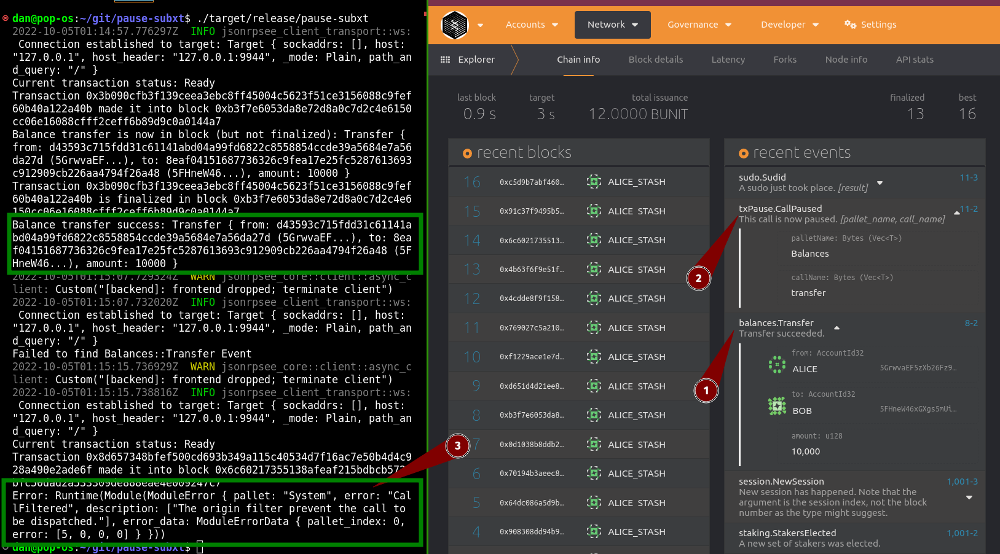

# `subxt` minimal demo

Demo of subxt using the tx-pause pallet.

## Preparation  

Before you can run the examples from the CLI included, you need to perform a few steps:

### Build a node with the kitchen sink included 😉

```bash
git clone git@github.com:paritytech/substrate.git
# Note you must select a branch that includes these pallets
cd substrate
cargo b -r
# Wait a while....

./target/release/substrate --dev
```

### Get your networks's metadata with `subxt-cli`

Install [subxt](https://github.com/paritytech/subxt#downloading-metadata-from-a-substrate-node) and download the metadata for your node.

```
cargo install subxt-cli

# With node running separately as setup above,
# run the following from the working dir of
# where you cloned this example: 

cd pause-subxt

subxt metadata -f bytes > artifacts/metadata.scale
```

An example of the [artifacts/node-metadata.json](artifacts/node-metadata.json) for human inspection and [artifacts/node-metadata.scale](artifacts/node-metadata.json) for use in the application is included (_that likely not work for you, depending on the node's version in the future!_)

## Run this demo

> We suggest to [open a Polkadot.js Explorer](https://polkadot.js.org/apps/?rpc=ws%3A%2F%2F127.0.0.1%3A9944#/explorer) for your local node to watch events come in while this example is submitting some test extrinsics are submitted.

From the directory containing this README run:

```
cargo b -r

# wait....

./target/release/pause-subxt
```

Example expected output:



